# Dashboard Tour

The dashboard opens from the **Axyome XM** icon in the Activity Bar, from the
Command Palette (**Axyome XM: Show Dashboard**), or with `Ctrl+Shift+Alt+M`
(`Cmd+Shift+Alt+M` on macOS).

It has 8 tabs. The header filters (time scope, repository, assistant) apply to
every tab. Most tabs cover both GitHub Copilot and Claude Code.

| Tab | Sub-tabs |
|-----|----------|
| **Home** | (single page) |
| **Activity** | Coding, History, Heatmap, Live, Unified |
| **AI** | Overview, Sessions, Models, Time, Value |
| **Quality** | Score, Errors, Hotspots, Patterns, Value |
| **Intel** | Score, Progress, Actions, Value, Knowledge |
| **Wellness** | Radar, Flow, Trends, Recommendations |
| **Replay** | Time Machine, Map, Wiki, Use |
| **System** | Overview, Queues, Tables, Sources, Badges, Account, Settings |

Screenshots below were captured from Axyome XM 0.2.826 on 2026-09-27 with real
activity data, at a normal sidebar width. The title bar shows the running version
(VS Code capitalises view titles, so it reads "V0.2.826"). Panels that list file
paths or personal notes were cropped out.

---

## Home

Authorship estimate (human / assisted / AI), velocity, quality, local builds,
commits, lines of code and AI agent success over the selected range.

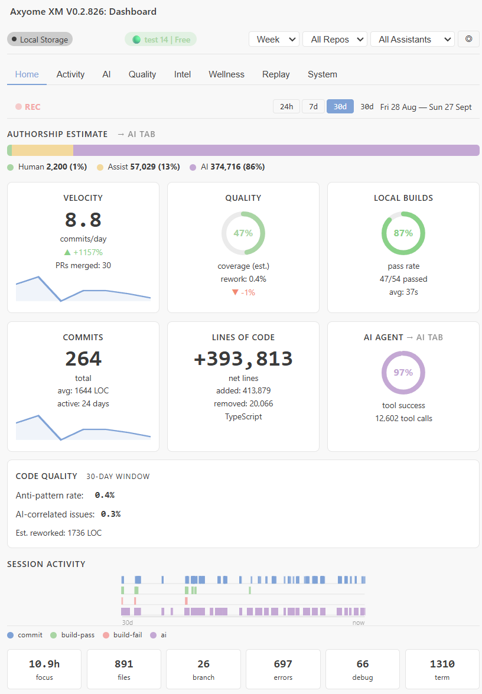

---

## Activity

Coding time per day, weekly totals and active files. The other sub-tabs show
history, a heatmap, a live feed and a unified timeline.

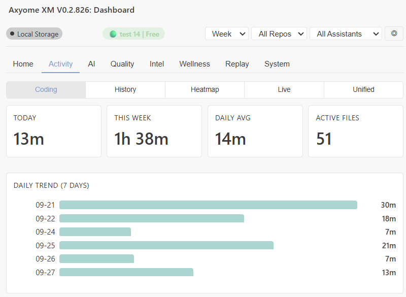

---

## AI

Authorship, AI agent tool success, AI-correlated code quality and the AI Tool
Index (ATI). When both GitHub Copilot and Claude Code have activity in the
selected range, a side-by-side comparison of the two assistants is shown too.
The other sub-tabs cover sessions, models, time and value.

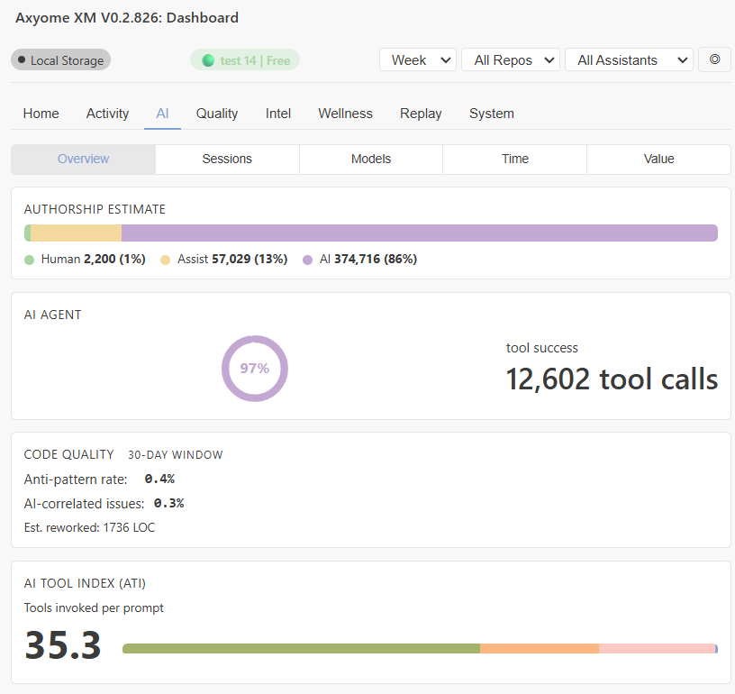

---

## Quality

Quality grade, error and warning findings, DORA metrics computed from git, and
code quality indicators.

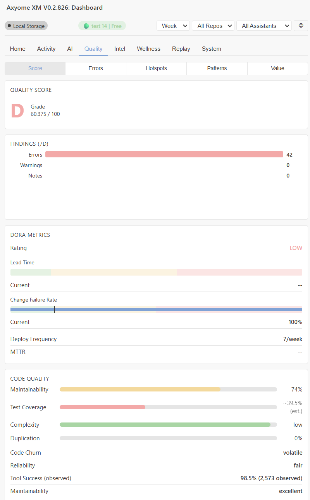

---

## Intel

The Developer Intelligence score, your level, and the four pillars: Velocity,
Reliability, Efficiency and Learning, each with its trend.

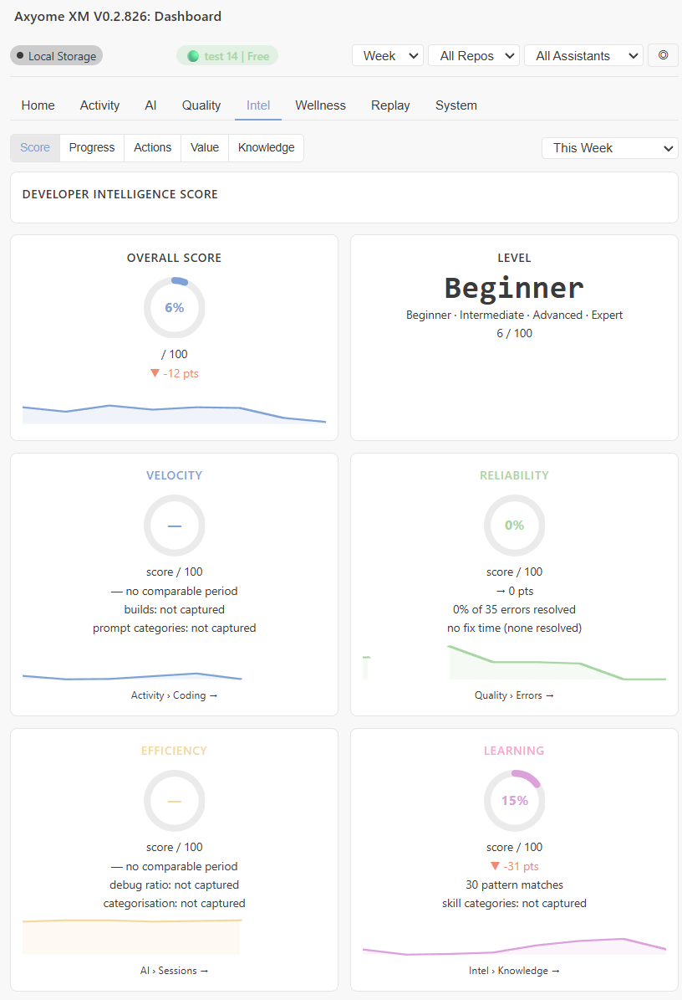

---

## Wellness

Wellness score, flow time, flow quality, cognitive load, work-boundary streak
and the weighted cognitive dimensions behind the score.

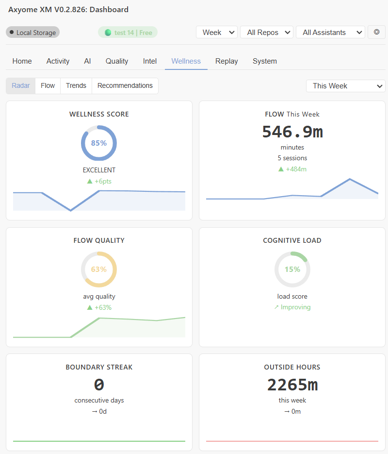

---

## Replay

### Time Machine

Pick a day (or week) and load it. The summary shows events, chapters, active
time and errors, compared with your 30-day average.

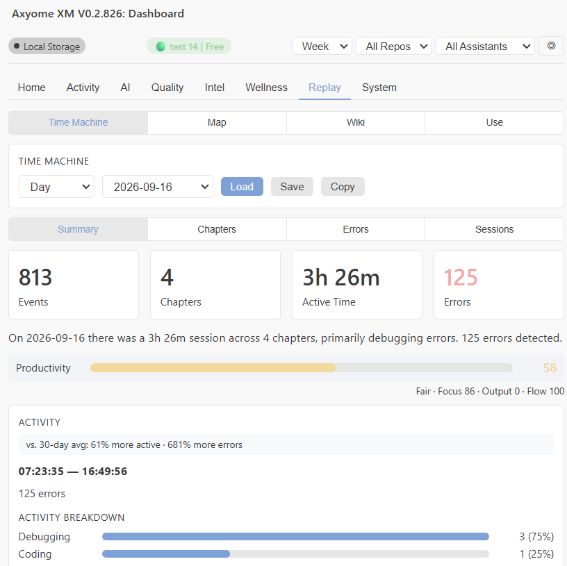

Chapters are detected automatically and colour-coded by activity type. Select a
chapter to see its events.

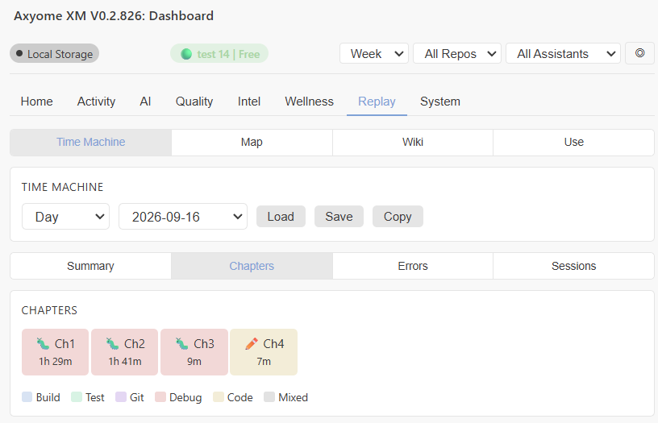

### Use

Memory size, tool calls, sessions this week, ATI ratio and the most used tools.

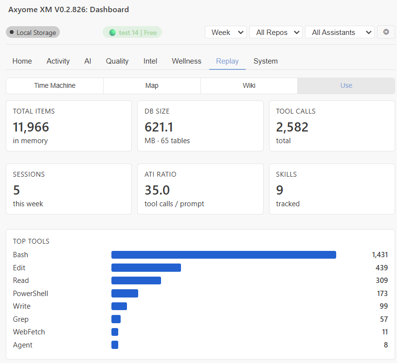

---

## System

### Overview

Events captured today, database size, queue depth and the top event sources.

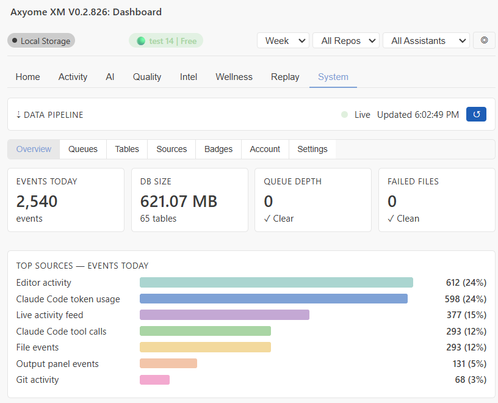

### Badges

The 12 achievement badges and when each was unlocked.

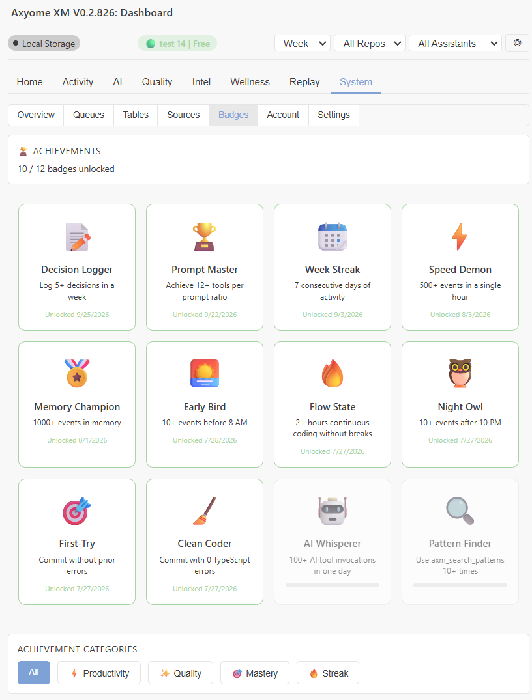
